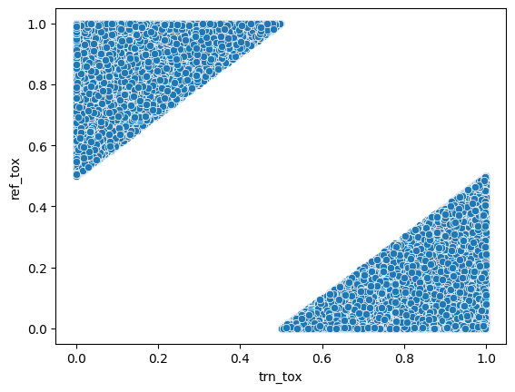

# Introduction

Internet is flooded with text data, and not all of it is safe or respectful. Offensive, harmful, or misleading content is a pervasive problem. This report explores the critical role of text detoxification in identifying and mitigating problematic content in textual data.

# Data analysis

The dataset is a subset of the ParaNMT corpus (50M sentence pairs). The filtered ParaNMT-detox corpus (500K sentence pairs). This dataset has reference and translated text, which also have it toxicity value from 0 to 1. Our subset contains only data in which reference and translation toxicity has difference at least 0.5 (You can see this on figure below).

# Model specification

Model used for this task is [t5-base](https://huggingface.co/t5-base):
- model size is 223 milions of parameters
- model is already pretrained

This model was selected because it is task agnostic and it supports Text2Text. So our goal would be fine-tune this model on detoxification.

# Training process

For training pytorch lighting and transformers were used.

For evaluation purposes 0.2 part of dataset was stored for evaluation.

Of the remaining data:
- Train: 0.8
- Validation: 0.1
- Test: 0.1

Other training parameters

- Optimizer: Adam, learning rate 0.001
- Epochs: 5
- Batch size: 200
- Maximum tokens length: 32

# Evaluation

Text detoxification is text to text task, for which is quite hard to use any predefined metric. We can use BLEU metric but it will not work on data without given translation and it does not care about semantic meaning. It is important because there is no optimal way of detoxification and multiple variant are acceptable. Thus, metric was proposed:
$$
    \text{score} = \frac{1}{N} \sum_{i=1}^{N} (P_t(r_i) - P_t(t_i)) \cdot \text{S}(r_i, t_i)
$$

Where 
- $P_t$ probability of text being toxic. Range $[0, 1]$
- $r$ testing/reference dataset, where $r_i$ is sentence, which need to be detoxified.
- $t$ translated dataset, where $t_i$ is a detoxified version of $r_i$. 
- $S(r_i, t_i)$ semantic similarity between two texts. Range $[0, 1]$

To compute this metric $S(r_i, t_i)$ will be pretrained [model](https://www.sbert.net/).

For $P_t$ DistilBert was used. It was finetuned on dataset for binary toxicity classification was used. It showed 0.05 cross entropy loss on test data.

# Results
Results on dataset that was not used in training is: __0.02176__

Results show that model can replace obvious toxic words and remake sentence. However, it fails to detoxify more complex toxicity, which do not include swear words. You can find some experiments in this [notebook](../notebooks/3.0-FinalSolutionExploration.ipynb). If you want to test it on yours data use `inference.py`.